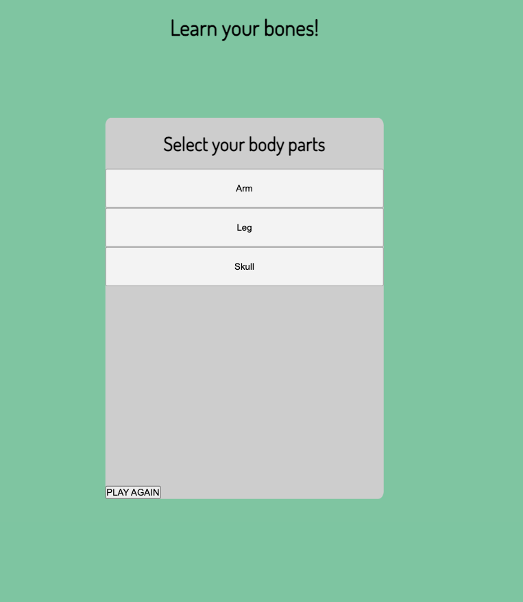
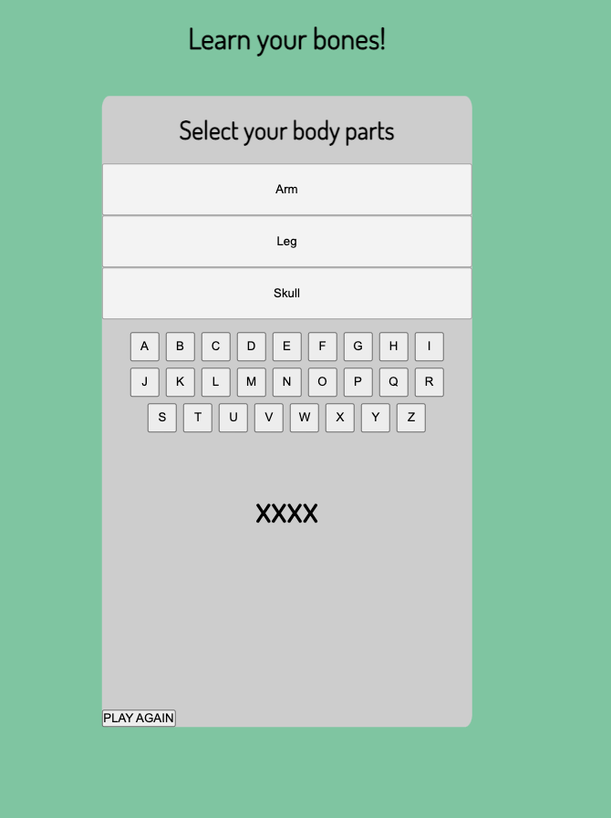

# Spaceman aka Learn Your Bones
## Description
Spaceman aka Learn Your Bones is a guessing game where the player guesses a word by suggesting letters.

## Screenshots

## TEchnologies Used
    -   HTML
    -   CSS
    -   Vanilla Javascript only

## Getting started
The link for the game:
https://aashumakova.github.io/Learn-Your-Bones/

The game is designed for students who are interested in learning the spelling of 206 bones of the human body. The computer generates categories of words for the player to choose from.
    - The player makes a choice of the word category.
    - The player makes a guess by suggesting letters.
    - The player wins, if the word is guessed within 5 guesses. 
    - The player loses if there are 5 wrong guesses.  
    - The player can push Play again button to try another word. 

## Planned future enhancements
    - add animation to display wrong guesses;
    - make the app mobile compatible;
    - add calm background soundscape;

